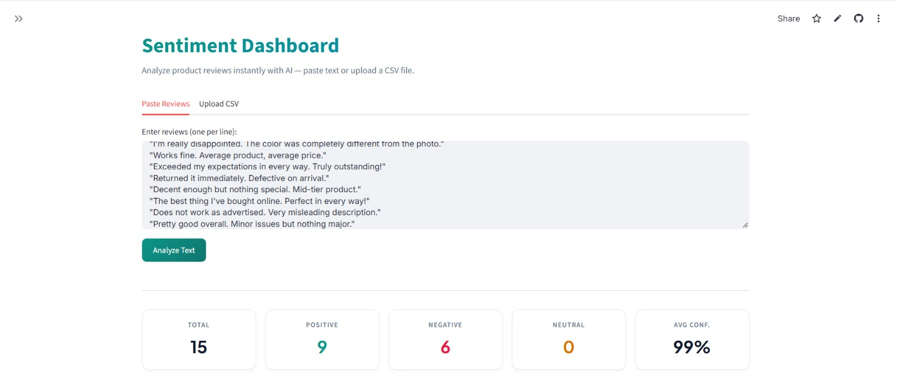
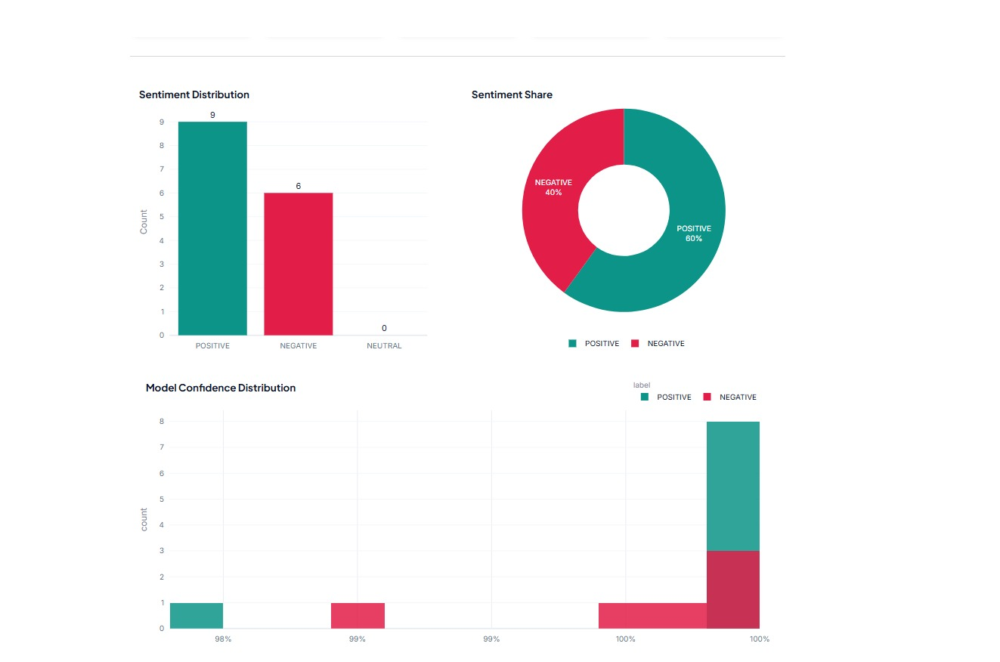
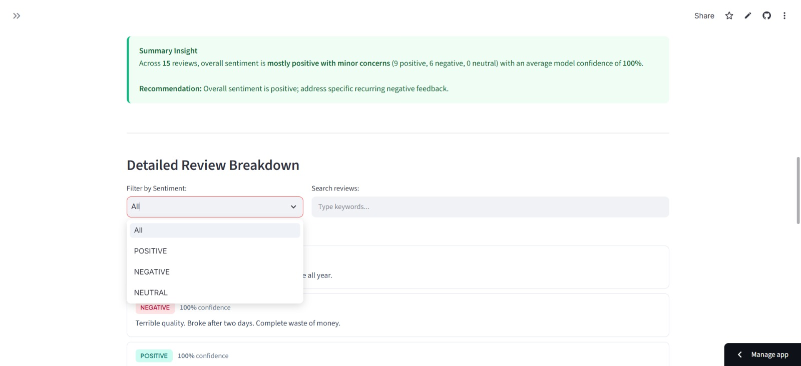

# Sentiment Dashboard for Product Reviews

An AI-powered web app that analyzes product reviews and classifies them as
Positive, Negative, or Neutral using DistilBERT — with live charts, confidence
scores, filter controls, and auto-generated business insights.

**Live Demo:** https://sentiment-dashboard-app.streamlit.app/ 
**GitHub:** https://github.com/MehXarii/sentiment-dashboard

---

## Overview



Paste reviews directly or upload a CSV file, click Analyze, and get a full
sentiment breakdown in seconds — powered by a pre-trained transformer model
with no API key required.

---

## Features

- Paste reviews (one per line) or upload a CSV file
- DistilBERT inference with confidence threshold for Neutral detection
- Bar chart and donut chart for sentiment distribution
- Per-review confidence chart
- Filter by sentiment label and search by keyword
- Auto-generated summary insight with business recommendation
- Download labeled results as CSV

---

## Screenshots

### Metric Cards and Charts


### Summary Insight Box


---

## Tech Stack

| Layer | Tool |
|---|---|
| Frontend | Streamlit, custom CSS |
| NLP Model | DistilBERT (HuggingFace Transformers) |
| Charts | Plotly |
| Data | pandas |
| Deployment | Streamlit Cloud |

---

## Run Locally

```bash
git clone https://github.com/MehXarii/sentiment-dashboard.git
cd sentiment-dashboard
pip install -r requirements.txt
streamlit run app.py
```

The first run downloads the DistilBERT model (~260MB) and caches it.
Every run after that is instant.

---

## Project Structure

sentiment-dashboard/
├── app.py # Main Streamlit app
├── style.css # External stylesheet
├── utils/
│ ├── analyzer.py # Model loading and inference
│ └── charts.py # Plotly chart generation
├── sample_reviews.csv # Test data (15 reviews)
├── requirements.txt
├── runtime.txt
└── README.md


---

## How It Works

1. User inputs reviews via text area or CSV upload
2. DistilBERT classifies each review as POSITIVE or NEGATIVE with a score
3. If confidence is below 65%, the label is overridden to NEUTRAL
4. Results are rendered as charts, metric cards, and a per-review breakdown
5. A rule-based insight engine generates a summary and recommendation

---

## About

Built by **Mehak Ansari** — BS Computer Science, University of Central Punjab (2023–2027).  
GitHub: https://github.com/MehXarii
LinkedIn: https://www.linkedin.com/in/mehak-ansari-80144a246?utm_source=share_via&utm_content=profile&utm_medium=member_android